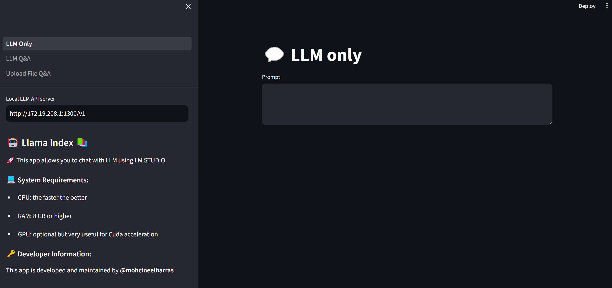
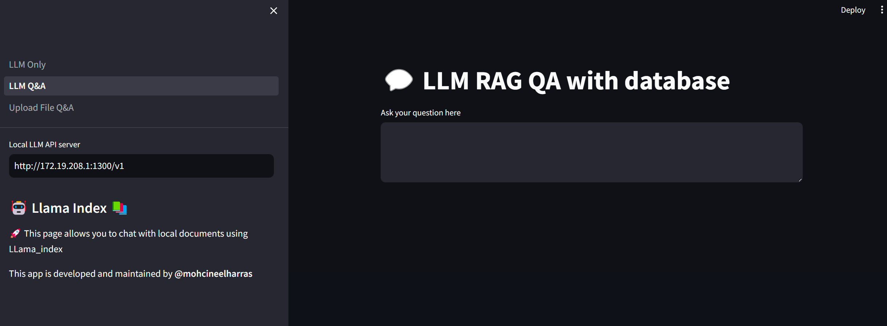
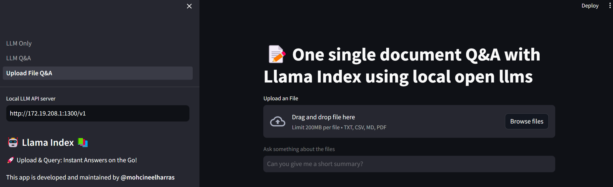

 # Exploring llama_index QA with Database

This is a beautiful application that utilizes local Open Source LLMs for different tasks, such as text generation, database interaction, and document uploading. The app has three tabs to make it more efficient and user-friendly:

1. **LLM_Only** - This tab allows you to request from an installed local LLM API server like LM Studio or any other compatible server. It provides basic functionality for text generation using the selected language model.

2. **LLM_Q&A** - In this tab, you can interact with a database of documents, ie, use a pre-existing database of documents to generate responses based on the information stored in the database. This is helpful when you want to search and retrieve specific data from your documents.

3. **Upload File and Q&A** - Upload your own document(s) and interact with them through a conversation interface. The application will generate responses based on the content of the uploaded document(s), allowing for deeper analysis and understanding of the text.

## Installation Guide

1. First, make sure you have Python installed on your system. Otherwise download it from [Python Downloads](https://www.python.org/downloads/), or using terminal if you are using linux

2. Create a virtual environment to isolate the app's dependencies from your main system:

   ```
   python -m venv venv
   ```
   or with conda
   ```
   conda create -n llama_index_docs python=3.11
   conda activate llama_index_docs
   ```

    then activate it using:

   ```
   source venv/bin/activate
   ```

3. Install the required packages by running:
   ```
   pip install -r requirements.txt
   ```

4. Launch the LM Studio API server or set up your preferred local LLM API server. Make a note of the URL and port number that you will need later.

5. Set your OpenAI API credentials as environment variables:
   ```
   export OPENAI_API_KEY="your_api_key"
   export OPENAI_API_BASE="http://localhost:1234/v1" # or the URL of your LLM server
   ```

6. Run the application:
   ```
   Streamlit run LLM_Only.py
   ```

## Using the App

Now that everything is set up, you can use the three tabs in the application to interact with your chosen language model(s). Feel free to explore and enjoy using this versatile LLM tool!

Don't forget to replace the `OPENAI_API_KEY` and `OPENAI_API_BASE` environment variables with your actual API credentials and server URL.

Happy experimenting! 💡👾

#### Screenshots:




