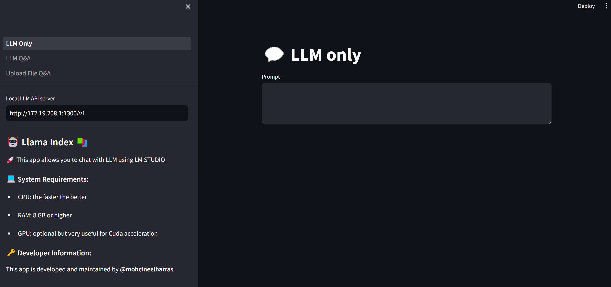
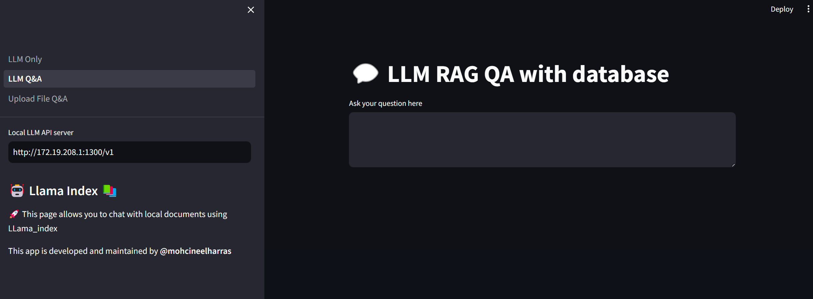
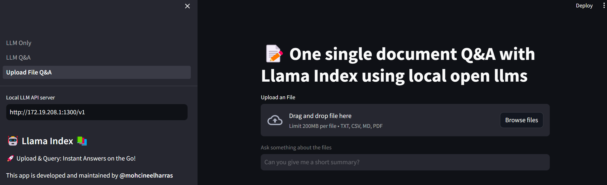

# Exploring llama_index QA with Database

This application harnesses the capabilities of local Open Source Large Language Models (LLMs) to perform tasks like text generation, database interaction, and document analysis. It's designed with three distinct tabs for an efficient and user-friendly experience:

1. **LLM_Only**: Engage directly with a local LLM API server (such as LM Studio) for text generation tasks using the chosen language model.

2. **LLM_Q&A**: Query a pre-populated database of documents to obtain responses based on the stored information, ideal for data retrieval and document search functionality.

3. **Upload File and Q&A**: Upload documents to interact with them via a conversational interface, enabling the application to generate responses based on the document content for a detailed text analysis.

## Installation Guide

1. Ensure Python is installed on your system. If not, download it from [Python Downloads](https://www.python.org/downloads/) or install it via terminal on Linux systems.

2. Isolate the app's dependencies by creating a virtual environment:

   With Python's venv:
   ```bash
   python -m venv venv
   source venv/bin/activate
   ```

   Or with Conda:
   ```bash
   conda create -n llama_index_docs python=3.11
   conda activate llama_index_docs
   ```

3. Install the necessary packages:
   ```bash
   pip install -r requirements.txt
   ```

4. Start the LM Studio API server or configure your local LLM API server, noting the URL and port number.

5. Set your OpenAI API credentials as environment variables:
   ```bash
   export OPENAI_API_KEY="your_api_key"
   export OPENAI_API_BASE="http://localhost:1234/v1" # Replace with your LLM server URL
   ```

6. Launch the app:
   ```bash
   streamlit run LLM_Only.py
   ```

## Using the App

With setup complete, the app is ready for use. Navigate between tabs to utilize the LLM features:

- In **LLM_Only**, input text prompts for model-generated responses.
- **LLM_Q&A** lets you query the document database for specific information.
- **Upload File and Q&A** offers a dynamic Q&A based on your uploaded content.

Remember to insert your actual `OPENAI_API_KEY` and `OPENAI_API_BASE` values.

Enjoy exploring the power of LLMs! 💡👾

#### Screenshots:






## Technologies & Skills

### Libraries

- **Streamlit**: For creating the web interface.
- **OpenAI's Whisper**: For speech-to-text capabilities.
- **LM Studio**: For local language model hosting.
- **SQLite**: As a lightweight database for document storage and retrieval.

### Skills

- **Natural Language Processing (NLP)**: Used for understanding and generating human-like text responses.
- **Data Engineering**: For setting up and managing the document database.
- **Web Development**: For crafting the front-end interface and connecting to backend APIs.

### Tools

- **Git**: For version control.
- **Docker**: Optional, for containerization and easy deployment.
- **Bash**: For scripting the installation and setup process.
- **UML Diagrams**: For planning and visualizing system architecture.
